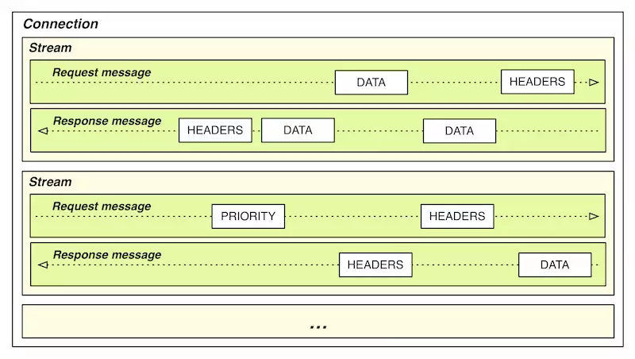

# 4 June, 2017

听过期了的尤雨溪大神的live分享`不吹不黑谈谈前端框架`，记一下笔记~

## 尤雨溪的live分享

1. 组件分类
    - 展示型组件，输入什么展示什么。就是dump组件
    - 接入型组件，与数据打交道，负责把数据传给dump组件。也就是smart组件
    - 交互型组件，比如各类加强版的表单组件，通常强调复用
    - 功能型组件，比如 `<router-view>`，`<transition>`，作为一种扩展、抽象机制存在
2. 状态管理

    从源事件映射到状态的迁移（状态管理），再由状态的改变映射到UI的改变（vm映射），状态管理就是为了解决前一个步骤，如何把管理状态迁移的代码从组件中剥离出来

    目前有两类派别

    1. 一种是以`redux`为首，推崇数据不可变，state只能通过action来改变。`action(curState) => newState`
    2. 另一种以`mobx`为首，数据是可变的，响应式的，改变一个数据可以更新与他相关的其他数据

    vue本身是mobx型的，但也可以通过`redux`或者`vuex`来管理状态。我的理解是，mobx型的管理适合小的、简单的应用，更为轻量级；而redux更适合大型应用，通过规范确保状态流predicatable，但会有很多冗余代码

    有2个很有意思的栗子：

    - 把 Vue 当 redux 用: https://jsfiddle.net/yyx990803/0a22ojps/
    - 让 Vue 当 MobX 用: https://jsfiddle.net/yyx990803/f5a24dk3/

    Rxjs也可以用来管理状态，以数据为流管理state to UI的过程

    全局状态和局部状态

    1. 全局状态是多个组件都依赖的数据
    2. 局部状态是只归某个组件所有，这个我倾向于局部状态作为该组件内部的state，对外部不可见

3. 路由

    1. 路由的简单实现：声明url => component的映射表（路由表），动态替换component
    2. 难点：跳转hook，重定向，异步请求，别名，兼容hash和pushState等
    3. web路由与app路由的区别：app路由是卡片堆叠的形式，回退操作销毁当前卡片，展示盖在下面的前一张卡片；而web路由则是把当前body里的component销毁，再绘制下一个component，回退需要重绘之前的component

        要实现类似app的路由，是否可以在跳转到下一个url时，仅仅隐藏前一个component而非销毁，待回退时判断如果dom里存在该component则直接展示而非重绘
4. css方案

    - 跟 JS 完全解耦，靠预处理器和比如 BEM 这样的规范来保持可维护性，偏传统
    - CSS Modules，依然是 CSS，但是通过编译来避免 CSS 类名的全局冲突
    - 各类 CSS-in-JS 方案，React 社区为代表，比较激进
    - Vue 的单文件组件 CSS，或是 Angular 的组件 CSS（写在装饰器里面），一种比较折中的方案

5. 构建工具

    > 构建工具解决的其实是几方面的问题：
    >    - 任务的自动化
    >    - 开发体验和效率（新的语言功能，语法糖，hot reload 等等）
    >    - 部署相关的需求
    >    - 编译时优化

    目前前端的构建工具趋于完善，比如基于语法分析的AST语法树，js、css的打包编译工具webpack，rollup.js等，css的预编译语言sass，less，还有一些js的方言ts，coffee，实在非常丰富。个人认为，目前前端构建方案只需要把这些工具组合起来，根据工具的扩展（比如webpack的自定义loader）建立一些特殊的规则即可。

    同时在构建工具的编译过程中，可以插入很多代码分析、优化的方案，比如fb的`prepack`最近大放异彩，在vue里也对vue template做了很多编译时优化，最常见的是把模板里的静态数据直接以结果的形式输出

6. 跨平台渲染

    vue的ssr特性，还没怎么尝试过，可以在blog平台上尝试一把

7. 服务端数据通信

    主要讲了一下`Restful API`的缺点：不能cover细粒度的数据查询，会产生很多冗余的数据。对比Restful，讲了一些`GraphQL`的优点，GraphQL给前端开发者一个极其灵活的获取数据的通道，相当于直接把数据库抽象出一层来给前端使用，相比传统的SQL查询更加灵活。其实已经很久没有关注过GraphQL了，印象中GraphQL只在刚出来的那段时间火了一把，很少有人能把它带上生产线。

    GraphQL的落地有两方面的因素需要考虑

    1. 你的业务规模是否已经复杂到restful无能为力的地步，也就是说GraphQL是否能给你的业务带来极大的好处。毕竟部署GraphQL需要服务端支持
    2. GraphQL的安全性

8. 新技术

    尤大大提到了2个点

    1. 一是webcomponents，依赖浏览器的实现，目前来看也就chrome对它支持的很完善
    2. 另一个是webassembly，通过把其他语言（c语言）转成`wasm`（二进制文件），直接在浏览器上运行。我的理解，目前webassembly最大的优势是在动画和游戏上，用c直接操作openQL接口绘制图像

## http2.0新特性

1. header压缩技术

    http1.0的每个请求都会带上header信息（开销最大的是cookie和useragent），特别是cookie很大的域名。想想看：每个请求都要带上同样的header信息，是一笔很大的开销

    http2.0针对header做了一系列的压缩，基本可以达到首次请求header大小占比比http1.0小一半，之后的请求可能会减小到1/10左右

    具体是怎么实现的呢？

    

    1. 在浏览器和服务端都存一份静态字典（Static Table），包含常见的头部名称，以及特别常见的头部名称与值的组合。比如`method: GET`，压缩后只需要一个字节，标识它在静态字典中的**索引**即可
    2. 维护一份相同的动态字典（Dynamic Table），可以动态地添加内容。所以首次请求的header会比之后请求的大，因为**首次请求会把动态的内容加到动态字典里，下次请求只需要替换成索引**了
    3. 支持基于静态哈夫曼码表的哈夫曼编码（Huffman Coding）
2. server push技术（注意要与web push区分开）

    http2的server push是**服务端可以主动的向client push请求**

    > 服务端可以主动推送，客户端也有权利选择接收与否。如果服务端推送的资源已经被浏览器缓存过，浏览器可以通过发送 RST_STREAM 帧来拒收。

    server push解决了什么问题呢：浏览器在得到主文档后，要解析到资源位置（比如script标签，link标签）才会发请求，server push可以在主文档请求时就把这些资源一起push给client，以达到**让重要资源尽快加载**的目的。特别是现在spa项目，一般主文档只有一个container标签，不会有内容，首屏渲染开始的时间其实是main.js开始执行的时候，用server push可以尽早的把重要的文件返回

    webpush是服务端向浏览器push消息的通道技术，通过定义一套加密机制，可以在服务端主动向启用serviceworker且注册了push服务（pushManager和pushSubscription）的浏览器发送通知，浏览器通过serviceworker里注册的`fetch`事件接收数据。这项技术在国内没有铺开，原因很简单:GFW 墙~因为webpush需要用到GCM（Google Cloud Messaging）在国内无法使用。u4内核里的webpush需要搭载app的信道来通知客户端，再由客户端通知webview，webview再通知相应的serviceworker
3. 多路复用技术

    - 先说说http1.0的`keep-alive`。一个tcp连接的建立是非常耗时的过程，特别是请求完成后信道会被销毁，请求新的数据需要**重新建连**。keep-alive就是为了解决这种场景：建立一个长连接，一个请求结束后可以直接用这条信道发起一个新的请求而非销毁重连。这样节省了大量重新建连的耗时。**现在浏览器在`同一域名`下可以建立`6-8`个长连接**。但是keep-alive有个问题，虽然节省了重连，但是每个keep-alive信道**同一时间只能发起一个请求**，如果之后还有请求，只能等到当前请求完成，如果有一个请求阻塞了，后面的请求都只能等待（Head-of-Line Blocking 队首阻塞）

    - http2.0的多路复用的实现是：同一域名建立一个tcp connection，这条信道以`stream`的形式传递**双向**`二进制数据`流，如下图：

        

        这就能很好解决队首阻塞的问题，同时对请求数也没有限制了。

    - 多路复用就不会关闭了么？

      > 多路复用使用的同一个TCP的connection会关闭么，什么时候关闭，这是个问题？从标准上看到一段文字：
  HTTP/2 connections are persistent.  For best performance, it is   expected that clients will not close connections until it is   determined that no further communication with a server is necessary   (for example, when a user navigates away from a particular web page)   or until the server closes the connection.  
      > 意思就是说关闭的时机有2个：
      >     1. 用户离开这个页面。
      >     2. server主动关闭connection

    - 开启同一个tcp连接的条件
        1. 同一域名下的资源；
        2. 不同域名下的资源，但是满足两个条件：
            1. 解析到同一个 IP
            2. 使用同一个证书；

        所以即使不再同一域名下，只要满足第二个条件，也是可以使用同一个tcp请求的

        > 上面第一点容易理解，第二点则很容易被忽略。实际上 Google 已经这么做了，Google 一系列网站都共用了同一个证书

4. reference

- [HTTP/2 资料汇总](https://imququ.com/post/http2-resource.html)
- [谈谈 HTTP/2 的协议协商机制](https://imququ.com/post/protocol-negotiation-in-http2.html)
- [HTTP/2 中的 Server Push 讨论](https://imququ.com/post/server-push-in-http2.html)
- [HTTP/2 头部压缩技术介绍](https://imququ.com/post/header-compression-in-http2.html)
- [HTTP/2 与 WEB 性能优化（一）](https://imququ.com/post/http2-and-wpo-1.html)
- [HTTP/2 与 WEB 性能优化（二）](https://imququ.com/post/http2-and-wpo-2.html)
- [HTTP/2 与 WEB 性能优化（三）](https://imququ.com/post/http2-and-wpo-3.html)
