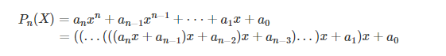

# 26 June, 2018

## Horner's Rule



```js
/**
 * horner' rule, T(n) = O(n)
 * 
 * @param {Array} setA set of a, from a1 to an
 * @param {Number} x
 * 
 * @return {Number} sum
 */
function horner(setA, x) {
    let n = setA.length;
    // reverse setA, let an be the first element
    let a = setA.reverse();
    let sum = 0;
    
    for (let i = 0; i < n; i++) {
        sum = a[i] + x * sum;
    }

    return sum;
}
```