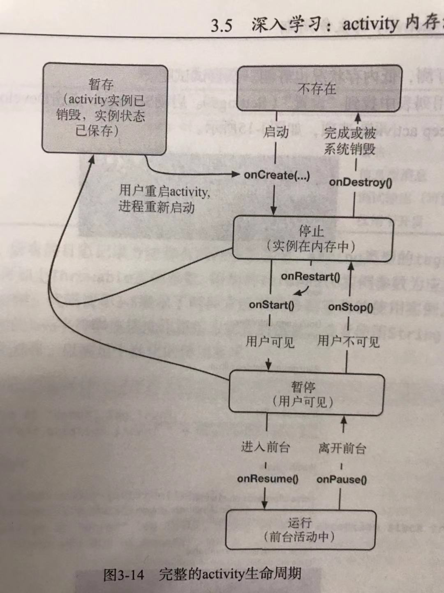

# Android Learning Notebook

## Questions

- How to build an Android app from scratch
- What's different between `Activity` and `Fragment`? Pros and Cons
- Activity lifecycle
- Bundle
- log
- explicit `intent` and implicit `intent`
- How to express `layout` in XML? What's different between android(XML) and Web(HTML)
- What is `Adapter`
- animation

## Activity

### Layout

- layout type

    extends from `ViewGroup`, utilized to contain other widgets

    - LinearLayout
    - FragmentLayout
    - RelativeLayout
    - TableLayout
    - FrameLayout

        like `position: relative`
- layout attributes (like css of web)
    - layout_width
        - match_parent

            size equals parent's size
        - wrap_content

            size depends on content inside, can resize when content changes
    - layout_height
    - layout_gravity 

        like `text-align`
    - **?** why no need padding between widgets?
- lenght unit
    - dpi, dots per inch, means how many dots in one inch at the diagonal line of device
    - px, same with css
    - dp, as named dip, density-independent pixel, is a device-unrelated unit

        1 dp = 1px in a device which dpi = 160, so when in a 320-dpi device, 1 px = 320 / 160 = 2 px

        formula: `px = (dpi / 160) * dp`, which means one device has larger dpi, 1 dp represents more px 
- res
    
    res dir contains all the resources in the app

    - `./values/strings.xml` store string resouces, can be referenced
    - `./layout` store layout files
    - `./drawable` store image files with different definitio


### Lifecycle



**State in lifecycle**

- non-exist

    not initialized
- stoped

    initialized, but not in the visual area
- paused

    initialized, in the visual area or only part in it
- running

    initialized, in the visual area, in the front of all the activities
- staging

    activity is destroyed, but the bundle of activity is saved, if the activity invoke later, system will resume it with the saved bundle

**Hooks in lifecycle**

- `onCreate(Bundle): void` invoke when activity created
- `onStart/onRestart(Bundle): void` finish initial, be in `stoped` state
- `onStop(Bundle): void` from `paused` to `stoped`, 
- `onResume(Bundle): void` from `paused` to `running`
- `onPause(Bundle): void` from `running` to `paused`
- `onDestroy(Bundle): void` from `stoped` to `non-existed`

`onSaveInstanceState(Bundle): void`  is not a hook, but it's related with lifecycle. often invoked before `onStop`, but if **back button** clicked, it will not be invoked, cause the activity is not being used

**Bundle** is an Object which can store `key-value` data:

```java
bundle.putInt('key', 1);
```

**Q**:

1. what's the situation when an activity is in `paused` stage

## Intent

- `public Intent(Context packageContext, Class<T> activityCls)`
- `public Intent putExtra(string key, <T> val)` 
- startActivity(Context packageContext, Class activityCls)

ActivityManager

- startActivityForResult(Context packageContext, Class activityCls, int requestCode)
- setResult(int result, Intent data)
- onActivityResult(int requestCode, int resultCode, intent data)

## Fragment

## misc

- MVVM vs MVC
    1. mvc don't support data binding, every change will go through `controller`.

        In mvvm, data binding is nature, think about `vue`
        
    2. in mvvm, view and model directly communicate with each other through `viewModel`.
        in mvc, all the logics about handling data are in `controller`
    3. pros
        1. mvvm has data binding, which is very clean and easy for developers to manage changes between view and model
    4. cons
        1. data binding cost much more memory than mvc because of its autoupdate feature, think about `vue`
        2. controllers in mvc increase sharply when app scale increase, and become diffcult to manipulate