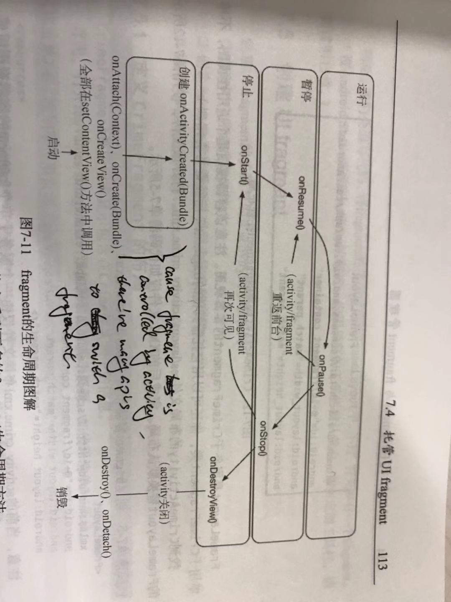

# Android Learning Notebook

## Questions

- How to build an Android app from scratch
- What's different between `Activity` and `Fragment`? Pros and Cons
- Activity lifecycle
- Bundle
- log
- explicit `intent` and implicit `intent`
- How to express `layout` in XML? What's different between android(XML) and Web(HTML)
- What is `Adapter`

    Adapter is a bridge between `data model` and `view`
- animation
- what is the `LayoutInflater` used for?
- `LayoutManager`

## Activity

### Layout

- layout type

    extends from `ViewGroup`, utilized to contain other widgets

    - LinearLayout
    - FragmentLayout
    - RelativeLayout
    - TableLayout
    - FrameLayout

        like `position: relative`
- layout attributes (like css of web)
    - layout_width
        - match_parent

            size equals parent's size
        - wrap_content

            size depends on content inside, can resize when content changes
    - layout_height
    - layout_gravity 

        like `text-align`
    - **?** why no need padding between widgets?
- lenght unit
    - dpi, dots per inch, means how many dots in one inch at the diagonal line of device
    - px, same with css
    - dp, as named dip, density-independent pixel, is a device-unrelated unit

        1 dp = 1px in a device which dpi = 160, so when in a 320-dpi device, 1 px = 320 / 160 = 2 px

        formula: `px = (dpi / 160) * dp`, which means one device has larger dpi, 1 dp represents more px 
- res
    
    res dir contains all the resources in the app

    - `./values/strings.xml` store string resouces, can be referenced
    - `./layout` store layout files
    - `./drawable` store image files with different definitio

    localize

    set localize will automatically create `values` with prefix of specific language

### Lifecycle


**State in lifecycle**

- non-exist

    not initialized
- stoped

    initialized, but not in the visual area
- paused

    initialized, in the visual area or only part in it
- running

    initialized, in the visual area, in the front of all the activities
- staging

    activity is destroyed, but the bundle of activity is saved, if the activity invoke later, system will resume it with the saved bundle

**Hooks in lifecycle**

- `onCreate(Bundle): void` invoke when activity created
- `onStart/onRestart(Bundle): void` finish initial, be in `stoped` state
- `onStop(Bundle): void` from `paused` to `stoped`, 
- `onResume(Bundle): void` from `paused` to `running`
- `onPause(Bundle): void` from `running` to `paused`
- `onDestroy(Bundle): void` from `stoped` to `non-existed`

`onSaveInstanceState(Bundle): void`  is not a hook, but it's related with lifecycle. often invoked before `onStop`, but if **back button** clicked, it will not be invoked, cause the activity is not being used

**Bundle** is an Object which can store `key-value` data:

```java
bundle.putInt('key', 1);
```

**Q**:

1. what's the situation when an activity is in `paused` stage

## Intent

`./intent.md`

### explicit intent and implicit intent

explicit intent need the class of **target** activity 

implicit intent only need the intent info(uri, action ...).
implicit intent need the target activity declare it in the xml, and set the filter condition if it doesn't want 
every one can invoke it

## take photo

1. get filepath to store the photo
2. set implicit intent to trigger Photo feature

    action: `MediaStore.ACTION_IMAGE_CAPTURE
    
    you can set the output path of image: `intent.putExtra(MediaStore.EXTRA_OUTPUT, pathUri)`
3. startActivityForResult
4. get file by `FileProvider`
5. create a `Bitmap` to display the image

## Fragment

### Lifecycle



1. hooks of lifecycle is `public`, cause activity which controlls this fragment will invoke them
2. `onCreateView` not `onCreate` is the hook initializing the fragment
3. `FragmentManager` and transection

### Fragment argument

fragment can save its own bundle, by `fragment.setArguments(Bundle)`. 

it's not like Bundle when `onCreate`, which is savedInstanceState, will not exist until fragment initilized.

fragment argument can be put when the fragment created, think of the fragment is a function, and fragment argument is the parameter

## Looper && handler

Looper is like `event loop` in js, but android supports **multiple-thread**, and **every thread has a looper**

we can create a thread by extends `HandlerThread`, and it has a looper and a `message queue`. message queue stores messages send to this handler, looper will take m

essages from queue when it idles

main thread also has one looper, cause main thread has many jobs to do, so heavy jobs should not put on main thread.
you can put a message on main thread by declaring it in main thread.

## SQLite

1. SQLite use a single file to store data
2. it's not a server, just a object read and write a db file
3. have index

## Async Task

`AsyncTask` class can do it, put async logic like **http request** in it(`doInBackground`), listen `onPostExecute` after it finished

`AsyncTaskLoader` is another way

## Shared Preferences

kind like `localStorage` in web

1. store data which can be persistent
2. global for the whole app

## misc

- MVVM vs MVC
    1. mvc don't support data binding, every change will go through `controller`.

        In mvvm, data binding is nature, think about `vue`
        
    2. in mvvm, view and model directly communicate with each other through `viewModel`.
        in mvc, all the logics about handling data are in `controller`
    3. pros
        1. mvvm has data binding, which is very clean and easy for developers to manage changes between view and model
    4. cons
        1. data binding cost much more memory than mvc because of its autoupdate feature, think about `vue`
        2. controllers in mvc increase sharply when app scale increase, and become diffcult to manipulate