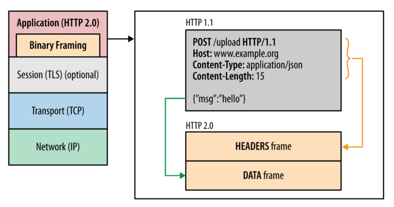

# http2.0

### Features

1. binary data transfer
2. header compression
3. multiplexing for single Tcp connection
4. server push resouces
5. security

### Binary data transfer

Text data transfer is using plain text as encoding type to transmit, .e.g ASCII coding for English is just fine.

Binary data transfer put content into binary data contains only 0 and 1. It has strict data format, like content length, which part is for what. We must at least know the way binary data encoded and how long a data frame got to decode it. And it has no reduntant data.

So it's more efficient in transfer. But Http is tramsiting by text data, so 2.0 embeds a layer into application layer to encode and decode binary data to text data, like this:

### header compression

using HPACK algorithm to compress http header

### multiplexing

In http1.1, there is allowed only several requests at the same time in one tcp connection.

In http2.0, one tcp connection can have many streams, and data is splited into frames with tag to label which stream it belongs to,
now frames can send without order, which is multiplexing

### server push resouces

It's not like server push in serviceworker. It is that server end can push resouces like images, html to browser even browser never request them, and browser will cache them for further usage.

### security

Based on https