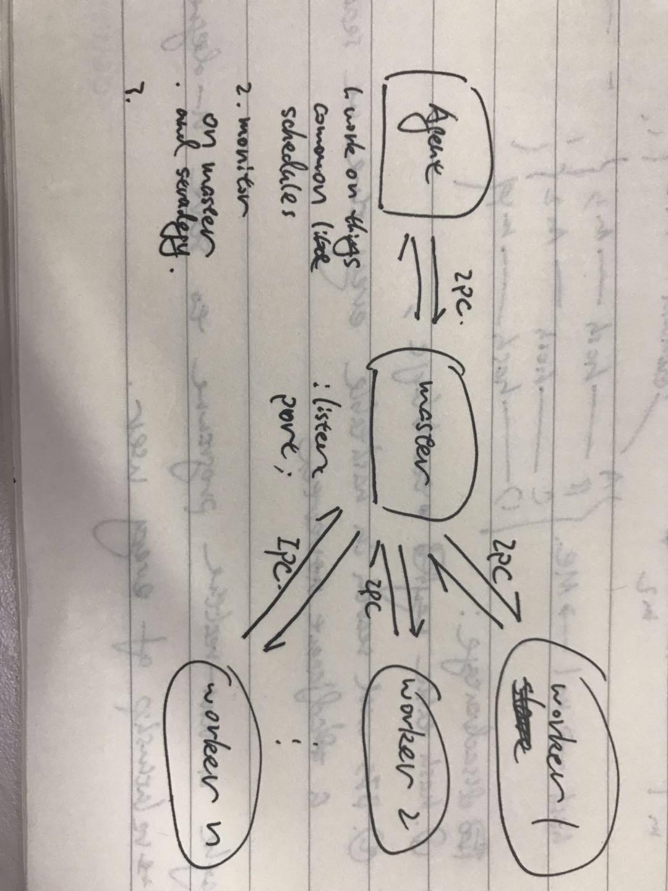

# Agent-Master-Slave Model from eggjs

Comparing to node cluster model, eggjs add `agent` into this model for doing something more common, like schedule tasks

agent process is forked by master, so it has IPC to master and can communicate with workers through master process.

agent can do more than that, e.g. monitor the master and workers, make stradegies for different situations

Problems:

1. Does eggjs use `cluster` module directly for it's multi-process model?
2. if 1 is true, how bad is **Roud-Roubin** as load balance algorithem when handle tasks takes quite differet time costs?

**Round-Roubin**

Slicing a process by constant time, when a process exhausts its time slice but not finished, make it enqueue, and dequeue a process, execute it. if new process comes , make it enqueue too.

[detail](https://blog.csdn.net/ytdxyhz/article/details/52760960)