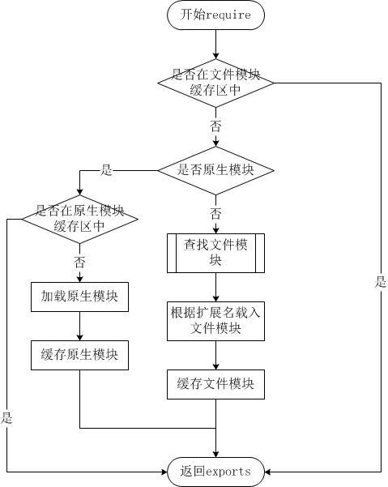

# node require mechanism



1.  find path(four ways, closest to farest)
    1. if it's a internal module like "http", return cache
    2. with relative or absolute path, get the absolute path by its parent's path, then there're two situations
        1. treated as file, then trying to add ext(`.js`, `.json`, `.node`), if found, return
        2. treated as directory, then trying to find `package.json`(attr **main**), `index.js`, `index.json`, `index.node`, if found, return
    3. without relative or absolute path, it may be installed in the `node_modules`, trying by its parent's path, like:

        exec `require('bar')` in `/home/ry/projects/foo.js`, it will search paths:
            
        1. /home/ry/projects/node_modules/bar
        2. /home/ry/node_modules/bar
        3. /home/node_modules/bar
        4. /node_modules/bar
    4. not found
2.  module declaration

    ```js
    function Module(id, parent) {
        this.id = id;
        this.exports = {};
        this.parent = parent;
        this.filename = null;
        this.loaded = false;
        this.children = [];
    }
    ```

    **parent attr can be utilized to update the dependencies chain**
3. module cache
    
    there is cache to store modules' exports when required once, it's like:

    ```js
    Module._cache = {
        'file_path': a, // module.exports of a.js
        // ...
    }
    ```
    
    filepath is unique, can be the key of map

4. load module

    Requiring a module which is not in the cache, we need load it from disk:
        
    1. get the filepath of this module
    2. fs.readFileSync to get code of this module
    3. wrapper it with:

        ```js
        (function (exports, require, module, __filename, __dirname) {
        // 模块源码
        });
        ```
        
        `require` function, `module` are all from global, which is generate before apply it, and the source code of a module is just to generate module's exports. 
    4. exec it, and put module.exports into cache, then return exports