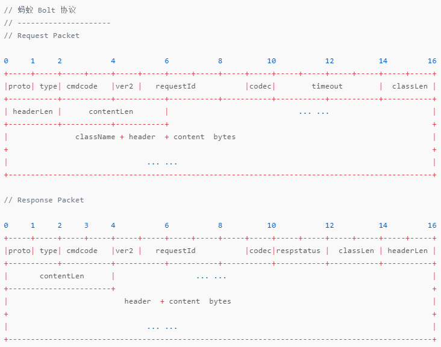

# node RPC

RPC is short of **Remote Procedure Call**, it's a way that different servers can invoke methods of each other.

it's a brief procedure:

1. **client** send a request
2. rpc server in client serialize the request into packet, send to network center. It's like dns I guess, the network center knows which machine the client want to request. In sofa, zookeeper do the job
3. rpc server in server receives packets from network center, assemble them packages, then deserialze to rpc request object to **server**
4. server get the rpc object, invoke methods rpc request, and return the result to rpc server
5. rpc server send the result to client 
6. client receive the result 

what it contains:

1. protocol

## Protocol

There are two layers of protocols RPC contains

1. for **communication layer** or network layer, the protocol defines what the packet looks like, and how to assemble them to a complete package, just like **TCP** protocol. And usually RPC is built based on TCP, cause it gives developers more space to design network part, http protocol has many limits.
2. for **application layer**, it's a place transforming packages(payload of RPC) into a Object in current server, which is called **serialization** and **deserialization**. Notice that `JSON.stringify` and `JSON.parse` is one of ways to serialize and deserialize. Protobuf is another way

it's a packet looks like:

**how to cut a packet from request** we already know that header has fields for length of content, which is a common way in network to cut packet. But serialize need get the whold request object binary data to transform to request object, so this is not kind of stream