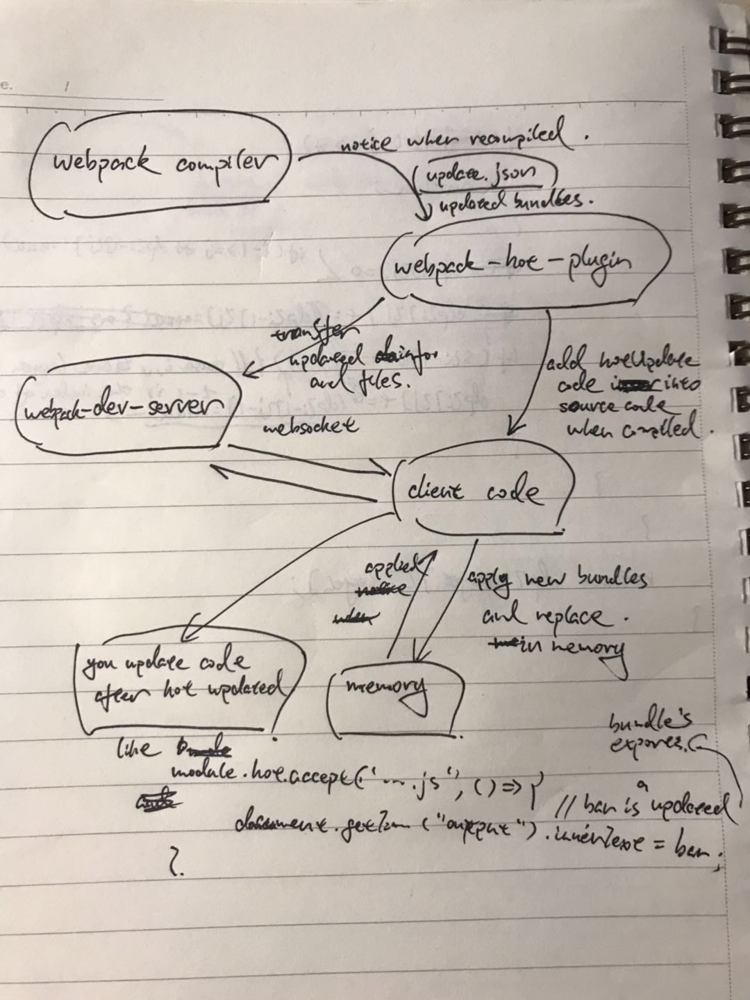

# HMR mechanism



There are 5 parts making up HMR:

1. **webpack compiler**, recompile when file changed
2. **webpack-hot-plugin**, got new updated info(e.g. manifest.json, new bundles). And it'll insert the client code into source code when compiled, which is the 4th part 
3. **webpack-dev-server**, or webpack-hot-middleware, which serve a server to communicate with client. It utilizes `websocket` or `eventsource` for intercommunication.
4. **client code** receives messages(data) from webpack-dev-server, and check(hot.module.check), apply(hot.module.apply) to update these outdated modules in memory(e.g. Module._cache).

    update action is a chain, cause the module updated may have parents, they need update too.
5. **hot handler** your code to handle how to react when hot update complete. It can handle every module you write, add code like this in the end of your module:

    ```js
    // ./xxx.js is modules required in the current module, i.e. it's children
    module.hot.accept('./xxx.js', () => {
        // your handler
    })
    ```